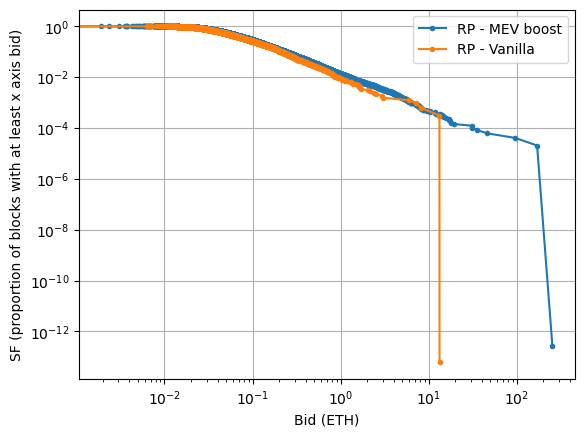
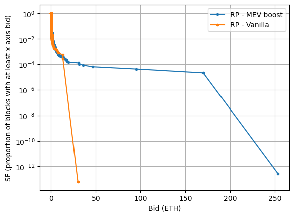
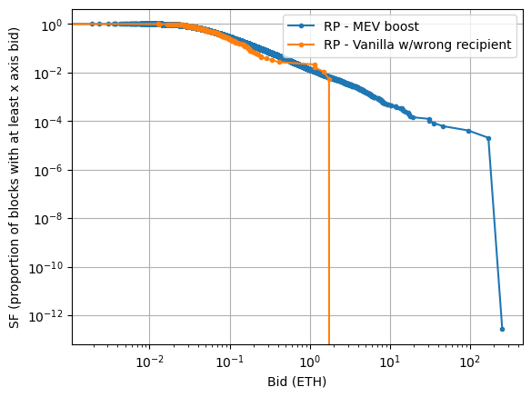
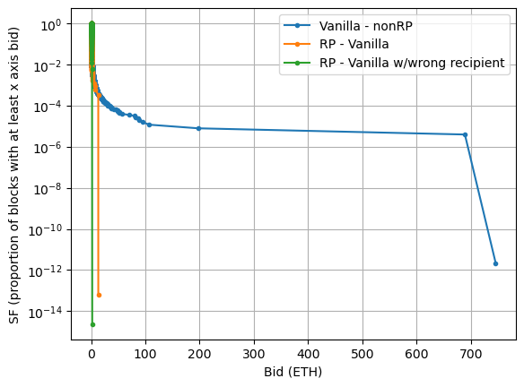

# RocketTheft
Tools for analysing and analysis of the performance of Rocket Pool validators in collecting priority
fees and MEV, and detecting MEV theft. Built for the Rocket Pool GMC's
[Bounty BA032304](https://dao.rocketpool.net/t/july-2023-gmc-call-for-bounty-applications-deadline-is-july-15th/1936/6).

## Analysis
We'll start high level and then go specific.
We analyze 40.7 weeks of data, starting right after the MEV grace period ended at slot 5203679
(2022-11-24 05:35:39Z UTC); see
https://discord.com/channels/405159462932971535/405163979141545995/1044108182513012796.

### Global vs RP sanity check
|    |  |
|:--------------------------------------:|:-------------------------------------------:|

The plot above shows a survival function for bids on all blocks and just RP blocks. This is mostly a
sanity check looking at if RP is being consistently lucky or unlucky, and we see no evidence that we
get better or worse bids. The curves move alongside each other well until data becomes too sparse to
be relied on, which is what we'd expect -- no evidence for different "luck" between RP and non-RP.

### Is there systematic theft?
|       |       |
|---------------------------------------------------|----------------------------------------------------------|
|  |  |
|   |   |

> **Reading these survival function plots**  
> For a point on the line, we can read it as "what is the probability (see y-axis) that we get a
> Bid of at least _this much_ (see x-axis)"? The theft hypothesis is that high value blocks would be
> over-represented (higher probability) for the lines other than "RP - MEV boost" (because thieves
> would opportunistically target valuable blocks).

The plots above are likely the most important item in this analysis. They show whether we routinely
see high bids on slots where either the recipient is wrong, vanilla blocks are used, or both. If we
routinely see these issues for lottery blocks, that would be significant evidence of theft.

Evidence for this would look like an orange line being to the upper right of the blue line. Even
more telling would be if this excursion only happened for blocks with high bids. We do not see any
such evidence.

- First row:
  - Overall, incorrect fee recipients using MEV boost are super rare; they follow the reference
    well for most of the curve and have no real lotto blocks to date.
  - 🤔 The line looks a little weird. The wrong recipient line is to the upper right of the blue
    line for the 0.2-0.4 ETH region. This is only a handful of cases, so fairly sparse and
    likely due to chance. It's also not "worth" stealing as a penalty should be applied and will
    make this size theft a net loss.
- Second row: if anything, it looks like vanilla blocks are underrepresented in slots with high max
  bids. theory is that since we're defining anything beyond RP-approved relays as "vanilla", then
  non-RP validators (some using other relays) should expect to have higher rewards on average than
  RP validators using no relay. Another theory to explain this would be that folks likely to use
  vanilla blocks (because no block is provided on time) don't use many relays, which means they get
  smaller max-bids on average. It's likely a mix of those effects.
- Third row: these match as well as plausible.

It's important to recognize a couple of limitations. First, the sample size for large blocks is very
small (especially not using MEV boost). Second, if an NO hasn't registered with any relays, they
won't get max bids and won't show up on this plot (see next section for an attempt to handle that).


### Is there systematic theft? Take 2
This is just like the above section, with a twist -- if there's no max_bid for a particular slot,
we take the mean max_bid of the 3 slots before/after as a proxy (or the mean of all max_bids in the
rare cases where that doesn't work). This tries to solve the second limitation mentioned above (NO
that never registered), but it comes at the cost of fidelity since we don't have actual data from
that block.

|       |       |
|---------------------------------------------------------|----------------------------------------------------------------|
|  |  |
|   |   |

There's no significant difference.

### Vanilla blocks: RP vs nonRP sanity check
|  |  |
|:-------------------------------------------:|:--------------------------------------------------:|

The plot above shows a survival function for bids on RP vanilla blocks vs non-RP vanilla blocks.
Ideally we'd expect the same curves to be followed. They mostly are.


### Current losses

Running `analysis.py` provides some text in addition to making the plots:

```
Analyzing 40.7 weeks of data (2051321 slots)
 100.0% of range; 40.7 weeks (2051321 slots)

bid2reward: mean=0.906 median=0.952

Filled in proxy max_bids for 19363 slots; 18280 were missingbloxroute max_bids

=== MEV-Boost Recipient losses  (see results/recipient_losses.csv) ===
1: 13 of 46987 MEV-boost slots used wrong fee recipient
3a: 0.874 total ETH lost due to wrong fee recipient
  Top 5 losses: 0.23, 0.14, 0.12, 0.09, 0.08
3b: 0.021 ETH lost per week
3c: APY was 4.401% when it should have been 4.401%
 aka, a 0.00% performance hit

=== Vanilla Recipient losses (see results/vanilla_losses.csv) ===
 688 of 4789 vanilla slots used wrong fee recipient (see results/recipient_losses_vanilla.csv)
~37.048 total ETH lost due to wrong fee recipient
  Top 5 losses: 1.30, 0.80, 0.72, 0.67, 0.58
~0.910 ETH lost per week
 APY was ~4.401% when it should have been 4.410%
 aka, a 0.21% performance hit
NB: We take a stab at vanilla losses using 90% of max_bid or sum of priority_fees, but it's possible
for vanilla blocks without max_bid to hide offchain fees

=== Non-recipient vanilla losses (see results/vanilla_losses.csv) ===
There were 4101 vanilla RP blocks w/correct recipient
  3442 had bids; we can get ~loss
  659 had no bid; we'll use nearby bids as a guess
4a: ~165.494 ETH lost due to not using relays (or theft)
  Top 5 losses: 17.24, 5.10, 5.07, 3.00, 2.77
4b: ~4.066 ETH lost per week
4c: APY was 4.401% when it could have been ~4.441%
 aka, a 0.91% performance hit

Sanity checking 2 ways of estimating the unknown loss: 43.371 vs 20.129
 if first method is much higher, that means we're seeing vanilla block more often than expected
 during periods that tend to have high max bids, which is a yellow flag... do note that outliers can
 move these a lot with respect to each other
```


### Conclusions
- 🚩 There are much too many vanilla blocks with wrong recipient - over 14% of vanilla blocks!
  - We should assign penalties
  - We should consider other mitigation (eg, disallow vanilla blocks entirely)
- We should assign penalties for bad recipient using MEV boost as well
- Vanilla blocks in general have been a significant loss (0.91% degradation in performance)
  - Note that ~10.4% of that is a single block. This was a vanilla block without any max bids and a
    correct fee recipient. We're approximating by:
    - Taking the mean of the 3 slots before and after, which are 28.02, 8.34, 46.84, 12.88, 45.94,
      and 37.25 ETH respectively
    - Finding the rETH share of that (64.5% here)
    - Adjusting for the priority fees that _were_ paid out
- Losses are a small, but not totally negligible, decrease in performance
  - MEV bad recipient: 0.00%
  - Vanilla bad recipient: 0.21%
  - Vanilla correct recipient: 0.91%
  - This adds up to 1.12%
    - To put that in perspective: as of 2023-09-05, this is equivalent drag to
      5.4k idle ETH (eg, in the deposit pool)

## Notes about the data
- "Vanilla" in the source csv files means:
  - "not an RP-allowed relay"
  - "not bloXroute ethical" (their API has been sunset, so we don't have that info)
  - Non-RP validators using MEV-boost on non-allowed relays might reasonably outperform RP vanilla
- To try to improve on "Vanilla" in this document, RP vanilla blocks are checked to see if they
  had bloXroute ethical rewards according to beaconcha.in. If so, they are simply dropped from the
  dataset to avoid polluting our set of Vanilla blocks. This _does_ mean that non-RP proposers have
  an advantage b/c they might use this relay (similar to any non-RP-allowed relay)
- There is an ambiguous period for ~3 days after a solo migration is initiated depending on whether
  the validator gets scrubbed. This was simply neglected. Back of the envelope math showed there
  were ~8 or so likely proposals in these periods