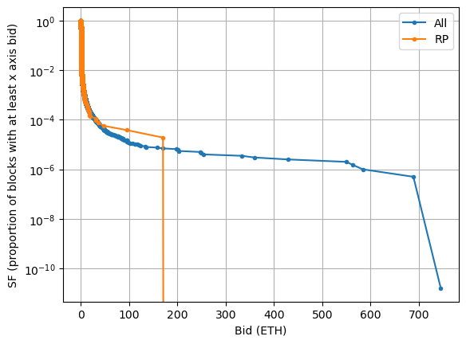
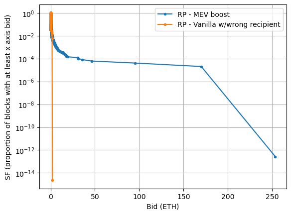
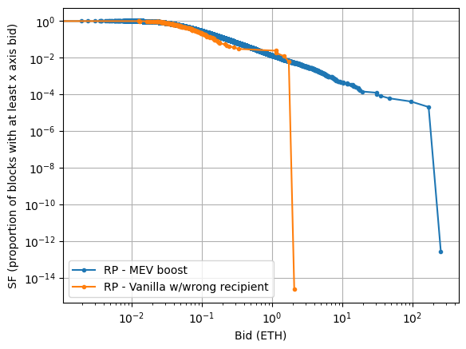
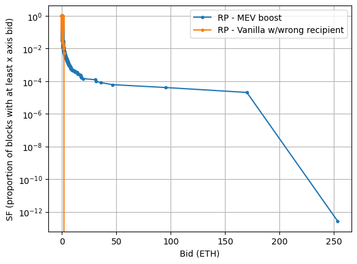

# RocketTheft
Tools for analysing and analysis of the performance of Rocket Pool validators in collecting priority
fees and MEV, and detecting MEV theft. Built for the Rocket Pool GMC's
[Bounty BA032304](https://dao.rocketpool.net/t/july-2023-gmc-call-for-bounty-applications-deadline-is-july-15th/1936/6).

## Analysis
We'll start high level and then go specific.
We analyze 40.7 weeks of data, starting right after the MEV grace period ended at slot 5203679
(2022-11-24 05:35:39Z UTC); see
https://discord.com/channels/405159462932971535/405163979141545995/1044108182513012796.

### Global vs RP sanity check
|    |  |
|:--------------------------------------:|:-------------------------------------------:|

The plot above shows a survival function for bids on all blocks and just RP blocks. This is mostly a
sanity check looking at if RP is being consistently lucky or unlucky, and we see no evidence that we
get better or worse bids. The curves move alongside each other well until data becomes too sparse to
be relied on, which is what we'd expect -- no evidence for different "luck" between RP and non-RP.

### Is there systematic theft?
|       |       |
|---------------------------------------------------|----------------------------------------------------------|
|  |  |
|   |   |

> **Reading these survival function plots**  
> For a point on the line, we can read it as "what is the probability (see y-axis) that we get a
> Bid of at least _this much_ (see x-axis)"? The theft hypothesis is that high value blocks would be
> over-represented (higher probability) for the lines other than "RP - MEV boost" (because thieves
> would opportunistically target valuable blocks).

The plots above are likely the most important item in this analysis. They show whether we routinely
see high bids on slots where either the recipient is wrong, vanilla blocks are used, or both. If we
routinely see these issues for lottery blocks, that would be significant evidence of theft.

Evidence for this would look like an orange line being to the upper right of the blue line. Even
more telling would be if this excursion only happened for blocks with high bids. We do not see any
such evidence.

- First row:
  - Overall, incorrect fee recipients using MEV boost are super rare; they follow the reference
    well for most of the curve and have no real lotto blocks to date.
  - 🤔 The line looks a little weird. The wrong recipient line is to the upper right of the blue
    line for the 0.2-0.4 ETH region. This is only a handful of cases, so fairly sparse and
    likely due to chance. It's also not "worth" stealing as a penalty should be applied and will
    make this size theft a net loss.
- Second row: if anything, it looks like vanilla blocks are underrepresented in slots with high max
  bids. theory is that since we're defining anything beyond RP-approved relays as "vanilla", then
  non-RP validators (some using other relays) should expect to have higher rewards on average than
  RP validators using no relay. Another theory to explain this would be that folks likely to use
  vanilla blocks (because no block is provided on time) don't use many relays, which means they get
  smaller max-bids on average. It's likely a mix of those effects.
- Third row: these match as well as plausible for the amount of data.

It's important to recognize a couple of limitations. First, the sample size for large blocks is very
small (especially not using MEV boost). Second, if an NO hasn't registered with any relays, they
won't get max bids and won't show up on this plot (see next section for an attempt to handle that).


### Is there systematic theft? Take 2
This is just like the above section, with a twist -- if there's no max_bid for a particular slot,
we take the mean max_bid of the 3 slots before/after as a proxy (or the mean of all max_bids in the
rare cases where that doesn't work). This tries to solve the second limitation mentioned above (NO
that never registered), but it comes at the cost of fidelity since we don't have actual data from
that block.

|       |       |
|---------------------------------------------------------|----------------------------------------------------------------|
|  |  |
|   |   |

There's no significant difference.

### Vanilla blocks: RP vs nonRP sanity check
|  |  |
|:-------------------------------------------:|:--------------------------------------------------:|

The plot above shows a survival function for bids on RP vanilla blocks vs non-RP vanilla blocks.
Ideally we'd expect the same curves to be followed. They mostly are. As previously noted, nonRP
"vanilla" includes some non-RP-approved relays and is thus likely to be slightly better. Within RP
vanilla, wrong fee recipient cases _might_ have slightly lower max bids? Hard to say given the low
amount of data we're looking at for the part that diverges.


### Current losses

Running `analysis.py` provides some text in addition to making the plots:

```
Analyzing 42.0 weeks of data (2116321 slots)
 100.0% of range; 42.0 weeks (2116321 slots)

bid2reward: mean=0.906 median=0.952

Filled in proxy max_bids for 19363 slots; 18280 were missingbloxroute max_bids

=== Removed slots ===
These slots are removed b/c we can't tell if they used an allowed relay or not
  due to miscategorizing, the fee recipient info in the csvs should be ignored
beaconcha.in relay tags for RP vanilla slots: Counter({None: 3975, 'bloxroute-ethical-relay': 529,
'agnostic-relay': 340, 'relayooor-relay': 27, 'aestus-relay': 10, 'manifold-relay': 5})

=== MEV-Boost Recipient losses  (see results/recipient_losses.csv) ===
1: 17 of 48880 MEV-boost slots used wrong fee recipient
3a: 2.110 total ETH lost due to wrong fee recipient
  Top 5 losses: 1.07, 0.23, 0.15, 0.14, 0.12
3b: 0.050 ETH lost per week
3c: APY was 4.266% when it should have been 4.266%
 aka, a 0.01% performance hit

=== Vanilla Recipient losses (see results/vanilla_losses.csv) ===
 187 of 3975 vanilla slots used wrong fee recipient
~8.640 total ETH lost due to wrong fee recipient
  Top 5 losses: 0.80, 0.67, 0.58, 0.44, 0.43
~0.206 ETH lost per week
 APY was ~4.266% when it should have been 4.268%
 aka, a 0.05% performance hit
NB: We take a stab at vanilla losses using 90% of max_bid or sum of priority_fees, but it's possible
for vanilla blocks without max_bid to hide offchain fees

=== Non-recipient vanilla losses (see results/vanilla_losses.csv) ===
There were 3788 vanilla RP blocks w/correct recipient
  3223 had bids; we can get ~loss
  565 had no bid; we'll use nearby bids as a guess
4a: ~159.375 ETH lost due to not using relays (or theft)
  Top 5 losses: 17.23, 5.10, 5.07, 3.00, 2.77
4b: ~3.796 ETH lost per week
4c: APY was 4.266% when it could have been ~4.304%
 aka, a 0.88% performance hit

Sanity checking 2 ways of estimating the unknown loss: 39.491 vs 19.052
 if first method is much higher, that means we're seeing vanilla block more often than expected
 during periods that tend to have high max bids, which is a yellow flag... do note that outliers can
 move these a lot with respect to each other
```


### Conclusions
- ⚠ There are a significant number of vanilla blocks with wrong recipient; ~4.7% of vanilla blocks!
  - We should assign penalties
  - We should consider other mitigation (eg, disallow vanilla blocks entirely)
- We should assign penalties for bad recipient using MEV boost as well
- Vanilla blocks in general have been a significant loss (0.91% degradation in performance)
  - Note that ~10.8% of that is a single block. This was a vanilla block without any max bids and a
    correct fee recipient. We're approximating the loss by:
    - Taking the mean of the 3 slots before and after, which are 28.02, 8.34, 46.84, 12.88, 45.94,
      and 37.25 ETH respectively
    - Finding the rETH share of that (64.5% here)
    - Adjusting for the priority fees that _were_ paid out
- Losses are a small, but not totally negligible, decrease in performance
  - MEV bad recipient: 0.01%
  - Vanilla bad recipient: 0.05%
  - Vanilla correct recipient: 0.88%
  - This adds up to 0.94%
    - To put that in perspective: as of 2023-09-05, this is equivalent drag to
      4.5k idle ETH (eg, in the deposit pool)

## Data notes
- We start analyzing at slot 5203679, which is after the grace period per
  https://discord.com/channels/405159462932971535/405163979141545995/1044108182513012796
- "Vanilla" in this analysis isn't really vanilla
  - Getting "vanilla" vs not would actually require (a) querying _all_ relays that exist, (b) having
    every relay that exists publish/store well so the querying is effective, and (c) no collusion.
    In other words, it would require trusting all relays and querying all relays.
  - Instead, we are using "used and RP-allowed relay" as our `MEV boost` category and "didn't use an
    RP-allowed relay" as our `vanilla` category.
    - On average, this should result in a small advantage to non-RP proposers, as they might have
      non-RP-allowed relays boosting their rewards but still show up as "vanilla".
  - Unfortunately, the "bloXroute ethical" API has been sunset, so we weren't able to use that
    properly. As a workaround RP vanilla blocks are checked to see if they had relay rewards
    according to beaconcha.in. If so, they are simply dropped from the dataset to avoid polluting
    our `vanilla` category with known MEV. Note that if multiple relays provide the same block,
    there's no way to tell which relays were actually on. In other words, if someone had a
    non-RP-allowed relay on, we're removing it from the list here.
      - This enhances the advantage mentioned above for non-RP proposers, as we remove mev-boosted
        vanilla blocks (from non-RP-allowed relays)
      - For the actual bloXroute ethical blocks, it goes both ways -- we don't end up counting them
        in `vanilla` (good to keep that category clean), but we also don't end up counting them in
        `MEV boost`
      - `correct_fee_recipient` shouldn't be trusted for these slots; because they were initially
        categorized as vanilla, we look for the fee recipient instead of a separate MEV reward
        recipient, which doesn't work in the cases that there _was_ a relay used
      - This is, unfortunately, a pretty large set of the "vanilla" blocks - about 19% of them
- Proxy max bids are used when needed
  - If a validator isn't registered with any MEV relays for a slot, it won't have a `max_bid`
    - We get the mean of the `max_bid`s from the 3 slots before and after the slot
    - If all of those are missing, we use a global average
  - If a validator has an `mev_reward` but no `max_bid`
    - We only saw this with some slots where bloXroute was the `mev_reward_relay`
    - We used the average BID2REWARD to derive a reasonable `max_bid` from the `mev_reward`
- Data artifacts
  - There were 13 slots that reported one or more `mev_reward`s from a bloXroute relay _and_ an
    `mev_reward` from another relay with mismatching reward sizes. The bloXroute mev_rewards were
    deleted in favor of the other relays based on beaconcha.in as a second opinion. The number of
    slots makes this negligible regardless. This applies to slots 6209620, 6209628, 6209637,
    6209654, 6209657, 6209661, 6209675, 6209814, 6209827, 6209867, 6209871, and 6209957.
  - There is an ambiguous period for ~3 days after a solo migration is initiated depending on
    whether the validator gets scrubbed. This was simply neglected. Back of the envelope math showed
    there were ~8 or so likely proposals in these periods.
  - There were 5 slots with over 20% `avg_fee` which is impossible. This is due to a bug that used
    overall minipool index instead of minipool index within a node. When someone initialized their
    fee distributor with a prelaunch pool, it would still add to commission b/c it grabbed from the
    overall index. This issue was hotfixed at slot 5104754.
- The largest MEV-boost recipient loss is from slot 6376024; this was due to a configuration error
  after a solo migration and the Node Operator immediately sent the correct amount to the
  smoothing pool (see
  https://etherscan.io/tx/0x18a28f9bba987a05bc87515faa6490cef3fe61b02dc45d68cffcf3a4e6f791a0)